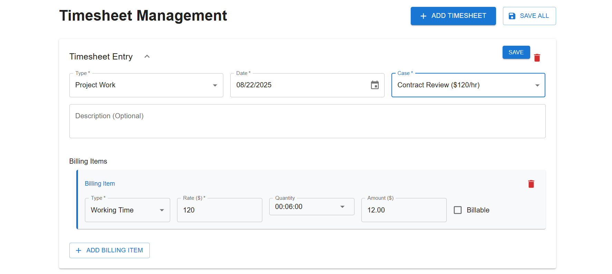
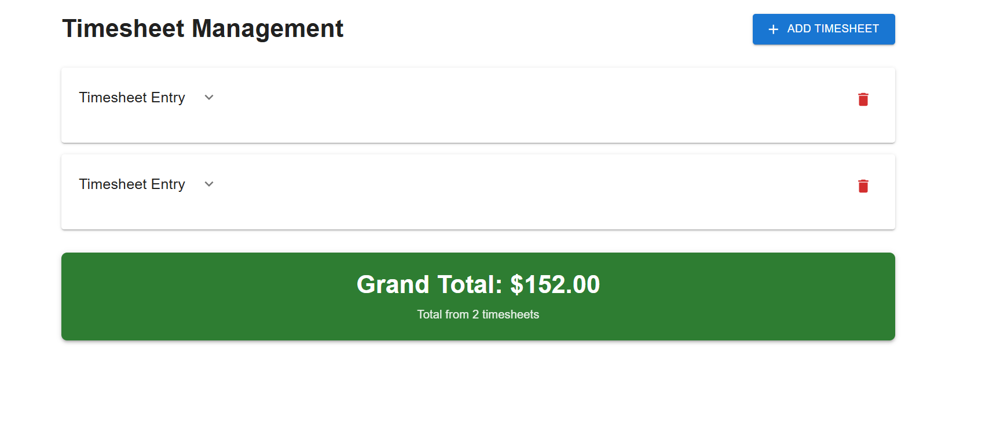

# MERN Timesheet Management System

A full-stack timesheet management application built with MongoDB, Express.js, React, and Node.js featuring dynamic time tracking, real-time calculations, and professional UI components.

##  Key Features

- **Dynamic Timesheet Management**: Add, edit, and delete timesheet entries with multiple billing items
- **Smart Time Input**: HH:MM:SS format with dropdown selection and 6-minute increments
- **Real-time Calculations**: Automatic amount calculation (Rate  Time Duration)
- **Collapsible Interface**: Expandable/collapsible timesheet sections for better organization
- **Professional UI**: Material-UI components with responsive design
- **TypeScript Integration**: Full type safety throughout the application
- **RESTful API**: Clean backend with MongoDB integration and data validation

  ##  ScreenShots

  
  

##  Quick Start

### Prerequisites
- Node.js (v18 or higher)
- MongoDB (optional - can use test server)

### Running the Application

**Option 1: With Test Server (No Database Required)**

1. **Start Backend (Test Server)**

   cd "E:\Mern Task\timesheet-backend"
   npm install
   npm run test-server

   
2. **Start Frontend** (New Terminal)

    cd "E:\Mern Task\timesheet-frontend"
   npm install
   npm start
   

4. **Access Application**
   - Frontend: http://localhost:3000
   - Backend: http://localhost:5000

**Option 2: With MongoDB Database**

1. **Start Backend (Full Server)**

   cd "E:\Mern Task\timesheet-backend"
   npm install
   npm run dev

2. **Start Frontend** (New Terminal)

   cd "E:\Mern Task\timesheet-frontend"
   npm install
   npm start

##  Technology Stack

### Frontend
- React 18.2.0 with TypeScript
- Material-UI (MUI) for components
- Context API for state management
- Axios for HTTP requests

### Backend
- Node.js with Express.js
- MongoDB with Mongoose
- Joi for data validation
- CORS for cross-origin requests

##  Key Functionality

### Timesheet Management
- Create new timesheet entries with employee details
- Add multiple billing items per timesheet
- Real-time amount calculation based on rate and time
- Collapsible sections for better organization

### Professional Features
- Responsive design for desktop and mobile
- TypeScript for type safety and better development
- RESTful API with proper error handling
- Clean, maintainable code structure

##  Usage

1. **Add Timesheet**: Click "Add Timesheet" button
2. **Fill Details**: Enter name, type, date, case, and description
3. **Add Billing Items**: Click "Add Billing Item" to add work items
4. **Configure Items**: Set type (Working Time/Travel Time/Kilometers), rate, and quantity
5. **View Calculations**: See real-time amount calculations and totals
6. **Save**: All changes are automatically saved

##  Deployment Ready

This project includes:
- Environment configuration for development and production
- Error handling and validation
- Clean API structure
- Professional UI/UX design
- TypeScript for maintainability

---

Built with  using the MERN stack for internship demonstration
